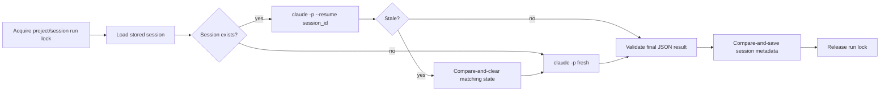
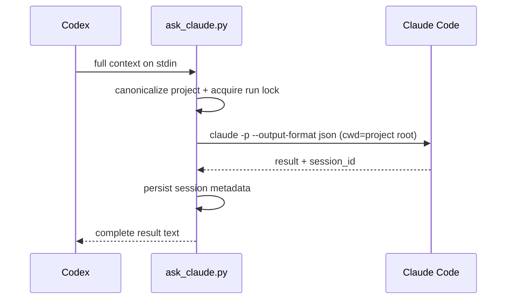

# claude-opinion internals

`claude-opinion` is intentionally a single-agent bridge: Codex composes context, one Claude Code process analyzes it, and Codex reconciles the result. It does not implement the multi-role fan-out, panel, voting, or judge layers used by council-style systems.

## Runtime split

The implementation has two layers:

- `scripts/_ask_claude_core.py` retains the established JSON transport, authentication routing, session persistence, stale-resume recovery, atomic state writes, and error handling.
- `scripts/ask_claude.py` is the supported entry point. It replaces execution policy with unbounded blocking, canonical project `cwd`, and a per-project/per-session run lock.

The core file is internal and must not be invoked directly.

## No wrapper limits

The active entry point calls both `claude --help` and `claude -p` without a `timeout=` argument. The main process uses:

```text
Popen(..., stdin=PIPE, stdout=PIPE, stderr=PIPE, text=True,
      cwd=canonical_project_root, start_new_session=True)
communicate(input=complete_stdin)
```

There is no normal wall-clock timeout, no wrapper turn/budget flag, and no input/output truncation. Completion occurs when Claude exits or the caller explicitly cancels. Ctrl-C kills the process group created by `start_new_session=True`, including Claude-spawned tool subprocesses.

The wrapper cannot remove limits imposed by the host process, operating system, Claude CLI/service, account, network, or model context window.

## Project identity

Project identity is:

```text
realpath(git rev-parse --show-toplevel)
```

Outside Git it falls back to:

```text
realpath(cwd)
```

The project key is the first 16 hexadecimal characters of SHA-256 over that canonical path. When `CLAUDE_OPINION_SESSION_KEY` is non-empty, a second 16-character SHA-256 prefix is appended.

```text
{project-hash}.json
{project-hash}-{session-hash}.json
```

The state directory is `$XDG_STATE_HOME/claude-opinion`, defaulting to `~/.local/state/claude-opinion`.

Canonicalizing both the state key and Claude child `cwd` makes calls from sibling subdirectories share the same wrapper state and Claude project namespace. Separate Git worktrees remain separate project roots.

## Single-agent ordering

A `.run.lock` beside the state file is held across the entire logical turn:



This is deliberately serialization, not orchestration. One project/session key has one ordered top-level Claude conversation. Independent projects or explicit session keys use different lock files and can run independently.

The shorter existing state lock still protects individual read/modify/write operations. The run lock prevents two complete calls from resuming the same thread concurrently; the state lock prevents file-level races and corruption.

## Session state

The core persists at least:

```json
{
  "session_id": "uuid",
  "project_path": "/canonical/project/root",
  "updated_at": "UTC timestamp"
}
```

An explicit session key is recorded when present. Writes use a temporary file and atomic `os.replace`. Generation-aware compare-and-save avoids clobbering a session ID written by another process. Stale clearing is compare-and-clear for the same reason.

Malformed state is moved to a collision-resistant `.corrupt.{nanoseconds}.{pid}` path. If quarantine cannot be completed, the call aborts before starting Claude because a successful new session could not be persisted safely.

## Resume protocol

Fresh invocation:



Follow-up invocation substitutes:

```text
claude -p --resume <stored-session-id> --output-format json
```

If Claude reports that the conversation/session no longer exists, the wrapper clears only the matching stale state and retries once as a fresh session. Non-stale errors remain hard failures.

## Command shape

The active command includes one `claude -p`, JSON output, the highest supported explicit effort, `--dangerously-skip-permissions`, `--add-dir <project-root>`, and an optional appended system instruction.

It intentionally omits:

```text
--agent
--agents
--max-turns
--max-budget-usd
--no-session-persistence
--bare
```

## Verification

```bash
python3 -m unittest discover -s tests -p 'test_*.py' -v
```

The policy tests verify that no timeout argument reaches the help probe or `communicate`, the full prompt/result survives transport, the child runs at the canonical project root, forbidden fan-out/limit flags are absent, and run-lock files are private (`0600`). The retained core suite continues to cover state races, corruption recovery, stale resume, command composition, authentication routing, and JSON error paths.
