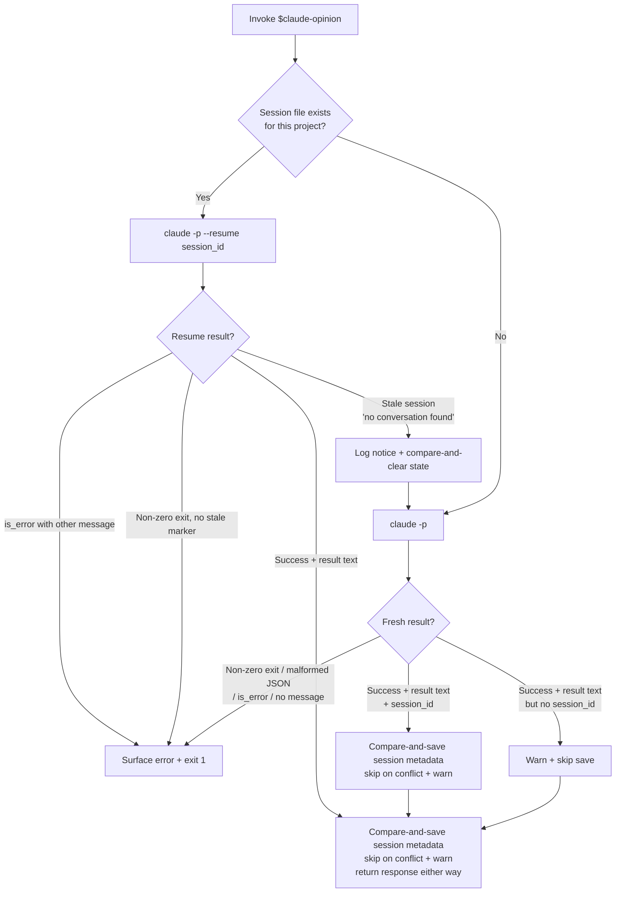

# claude-opinion internals

Implementation details for contributors and maintainers. User-facing docs live in [README.md](README.md).

## Protocol vs transport boundary

The skill layer (how to call Claude, how to build context, session continuity) lives in [`SKILL.md`](SKILL.md); runtime reconciliation is Codex's judgment. [`scripts/ask_claude.py`](scripts/ask_claude.py) is a transport shim: it appends a short default review directive plus an invariant safety directive (analysis-only) to Claude's system prompt, calls `claude -p --output-format json` with the highest supported `--effort` level inside its own process group (`start_new_session=True` so a `CLAUDE_OPINION_TIMEOUT` overrun can `killpg` the whole tree, not just the direct child), parses the outer JSON, and saves per-project session state under an `fcntl` lock. The auxiliary `claude --help` probe is bounded separately at 10 seconds.

Three generation-aware writes close the parallel-invocation races:

- **Stale-resume clearing** is compare-and-clear: the state file is only removed if its current `session_id` still matches the one we tried to resume.
- **Fresh-call saving** is compare-and-save: the new `session_id` only overwrites state if the file is missing or still holds the value we observed at entry (or the value we're about to write — a no-op success). If a parallel invocation has already persisted a different ID, our save is skipped with a stderr warning rather than clobbering theirs.
- **Resume-success saving** uses the same compare-and-save guard. Claude can rotate the session ID on resume, and a sibling invocation may have written a different fresh/resumed ID while we were blocked in `claude --resume <old>` — saving unconditionally would overwrite it.

A corrupt or unreadable existing state file does not collapse to "missing": atomic `os.replace` writes mean this script cannot produce invalid JSON itself, so a corrupt file implies external interference. `save_session` warns and refuses to overwrite rather than masking the problem.

Pass `--allow-edit` to drop the safety directive (only meaningful when you actually want Claude to modify files); `--no-default-instruction` skips both the review directive and the safety directive for raw stdin passthrough.

If Claude returns a result but no `session_id`, the script warns and still returns the result — the user's answer isn't worth discarding just because resume isn't possible next time. Save is skipped; the next call starts a fresh session.

The script strips `ANTHROPIC_API_KEY`, `ANTHROPIC_AUTH_TOKEN`, and `ANTHROPIC_BASE_URL` from the child env so Claude.ai subscription auth wins over API-key or proxy-gateway routing ([anthropics/claude-code#2051](https://github.com/anthropics/claude-code/issues/2051)). It also intentionally avoids `--bare`, because current Claude Code builds document that bare mode skips OAuth and keychain auth reads. Set `CLAUDE_OPINION_KEEP_ANTHROPIC_ENV=1` to opt out of the env stripping. When `CLAUDE_OPINION_SESSION_KEY` is set, the state key includes a hash of that value so that caller gets a separate Claude session for the same project.

The script does not interpret Claude's reply semantically, count rounds, or decide when to reconcile. Adding protocol state here would mix transport with judgment; that belongs in the skill.

## Session management flowchart



Stale resume can surface either as a non-zero exit with the marker on stderr, or as parsed JSON with `is_error: true` and a matching `errors[]` entry. The transport checks both (`_stale_marker_match` over stderr + `_is_stale_resume` over the parsed result) before any hard-fail branch.

## JSON protocol

`ask_claude.py` communicates with `claude -p --output-format json` via a single outer JSON object on stdout:

```mermaid
sequenceDiagram
    participant S as ask_claude.py
    participant X as Claude Code

    S->>X: claude -p --output-format json<br/>--effort highest<br/>(stdin = context body)
    X-->>S: {"result": "...", "is_error": false,<br/>"session_id": "uuid", "total_cost_usd": ..., ...}
    Note over S: _parse_result extracts outer dict
    Note over S: Resume path checks stderr + errors[]<br/>for stale markers before hard-fail
    Note over S: Both paths fail on is_error or missing result
    Note over S: On clean success, compare-and-save the<br/>returned or resumed session_id;<br/>skip with warning on conflict<br/>or when session_id is missing
    S-->>S: return result["result"]
```

`_parse_result` tolerantly parses the single JSON object; on malformed output it returns `None` and the caller hard-fails. If the Claude CLI output format changes (renamed fields, additional envelope), update `_parse_result` and `_is_stale_resume` in [`scripts/ask_claude.py`](scripts/ask_claude.py).
