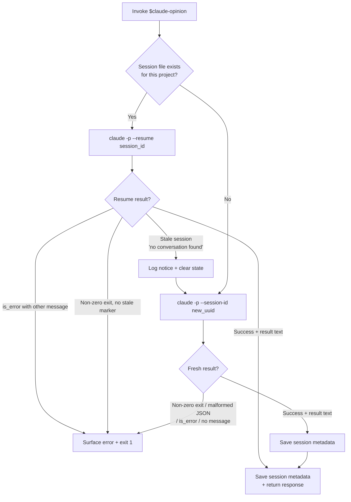
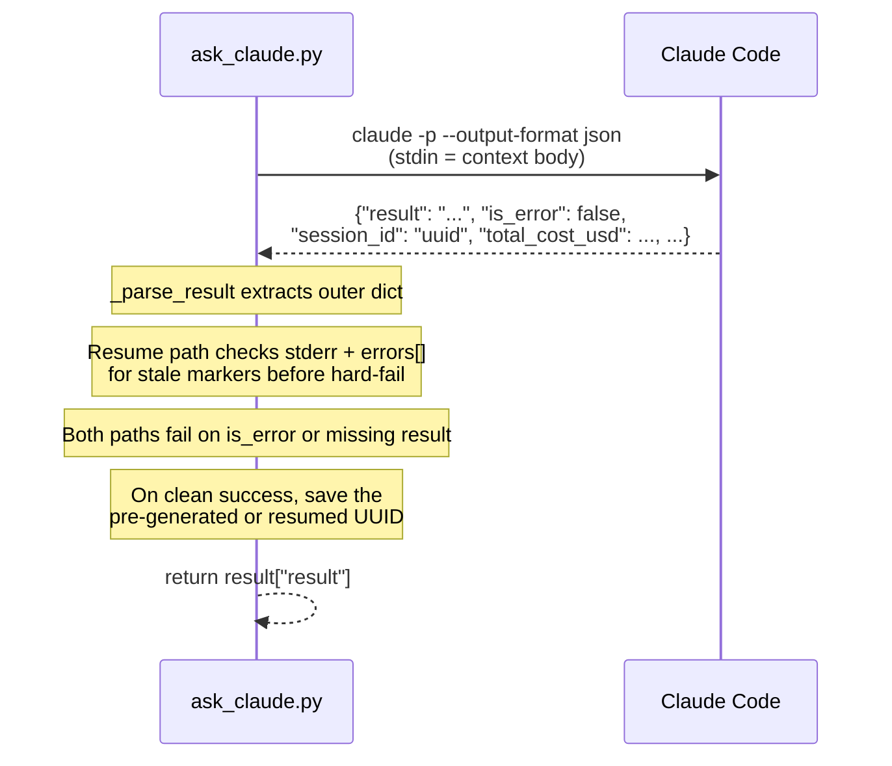

# claude-opinion internals

Implementation details for contributors and maintainers. User-facing docs live in [README.md](README.md).

## Protocol vs transport boundary

The skill layer (how to call Claude, how to build context, session continuity) lives in [`SKILL.md`](SKILL.md); runtime reconciliation is Codex's judgment. [`scripts/ask_claude.py`](scripts/ask_claude.py) is a transport shim: it appends a short default review directive to Claude's system prompt, calls `claude -p --output-format json`, parses the outer JSON, and saves per-project session state atomically. Pass `--no-default-instruction` to skip the system-prompt directive.

The script strips `ANTHROPIC_API_KEY`, `ANTHROPIC_AUTH_TOKEN`, and `ANTHROPIC_BASE_URL` from the child env so Claude.ai subscription auth wins over API-key or proxy-gateway routing ([anthropics/claude-code#2051](https://github.com/anthropics/claude-code/issues/2051)). Set `CLAUDE_OPINION_KEEP_ANTHROPIC_ENV=1` to opt out. When `CLAUDE_OPINION_SESSION_KEY` is set, the state key includes a hash of that value so that caller gets a separate Claude session for the same project.

The script does not interpret Claude's reply semantically, count rounds, or decide when to reconcile. Adding protocol state here would mix transport with judgment; that belongs in the skill.

## Session management flowchart

Stale resume can surface either as a non-zero exit with the marker on stderr, or as parsed JSON with `is_error: true` and a matching `errors[]` entry. The transport checks both (`_stale_marker_match` over stderr + `_is_stale_resume` over the parsed result) before any hard-fail branch.

## JSON protocol

`ask_claude.py` communicates with `claude -p --output-format json` via a single outer JSON object on stdout:

`_parse_result` tolerantly parses the single JSON object; on malformed output it returns `None` and the caller hard-fails. If the Claude CLI output format changes (renamed fields, additional envelope), update `_parse_result` and `_is_stale_resume` in [`scripts/ask_claude.py`](scripts/ask_claude.py).
