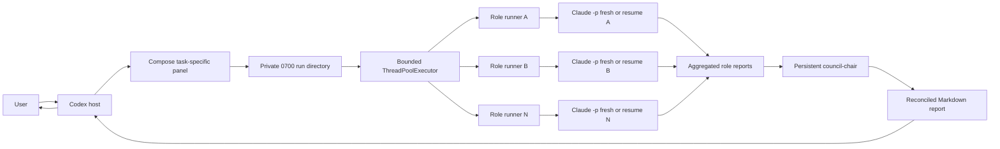
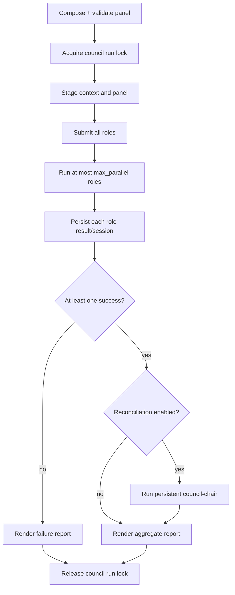

# claude-opinion internals

This branch adds a council orchestration layer on top of the persistent, unbounded single-agent transport.

- `scripts/_ask_claude_core.py` retains the established Claude JSON transport, auth routing, single-thread state machinery, stale-session detection, and error parsing.
- `scripts/ask_claude.py` remains the supported one-agent entry point with canonical project `cwd`, no wrapper timeout, and one run lock per project/session key.
- `scripts/claude_council.py` composes a role panel, launches persistent role sessions with bounded fan-out, stages artifacts privately, and runs a persistent chair reconciliation pass.

The council deliberately uses multiple top-level `claude -p` processes rather than Claude's `--agent` or `--agents` subagent flags. This makes role state, concurrency, failure containment, and reconciliation explicit in the wrapper.

## End-to-end architecture



The host still verifies the chair's synthesis. The chair is part of the implemented multi-agent path, not an excuse for Codex to relay output without checking it.

## Panel composition

Panel composition is deterministic and testable.

`auto` begins with:

```text
systems-architect
correctness-reviewer
adversarial-skeptic
```

It scans the complete task and shared context for domain signals and may add:

```text
reliability-operator
security-reviewer
test-strategist
research-methodologist
product-maintainer
```

Built-in panels provide fixed composition. A custom JSON manifest can replace them entirely and can add a panel-specific chair instruction.

Validation enforces:

- at least one role;
- unique role IDs;
- lowercase path-safe IDs;
- non-empty names and mandates;
- a path-safe panel ID.

Role state records a fingerprint over role name and instruction. Reusing an ID with a changed mandate quarantines the old state and starts fresh, preventing persona drift through accidental resume.

## Private staging

Each council turn creates a random temporary directory with mode `0700`:

```text
claude-council-<random>/
├── context.md
├── panel.json
├── roles/
│   ├── <role-a>.md
│   ├── <role-b>.md
│   └── <role-n>.md
└── report.md
```

Files and role subdirectories are private (`0600` and `0700`). Relative paths containing `..` or absolute paths are rejected. The directory is removed on exit unless `--keep-run-dir` is requested.

The staging area is for provenance and diagnostics; role prompts are still sent directly over stdin without a wrapper byte limit.

## Project/session/role identity

Project identity is:

```text
realpath(git rev-parse --show-toplevel)
```

or, outside Git:

```text
realpath(cwd)
```

The council scope key is:

```text
sha256(project-root)[:16]
```

with an optional suffix:

```text
- + sha256(CLAUDE_COUNCIL_SESSION_KEY)[:16]
```

If `CLAUDE_COUNCIL_SESSION_KEY` is empty, `CLAUDE_OPINION_SESSION_KEY` is the fallback. The role state filename additionally contains the validated role ID and a role-ID hash:

```text
{scope}--{role-id}-{sha256(role-id)[:12]}.json
```

State lives under:

```text
$XDG_STATE_HOME/claude-opinion/council
```

with `~/.local/state/claude-opinion/council` as the default.

Each state document contains at least:

```json
{
  "version": 1,
  "session_id": "uuid",
  "project_path": "/canonical/project/root",
  "role_id": "systems-architect",
  "role_name": "Systems Architect",
  "role_fingerprint": "sha256-prefix",
  "updated_at": "UTC timestamp"
}
```

## Council ordering and bounded fan-out

A council run lock is keyed by project and optional session namespace and is held across the complete logical turn:



The default maximum is four concurrent role processes. The hard supported range is 1–16. Panel cardinality can be larger; queued roles wait for a worker slot.

This lock prevents two complete council invocations from interleaving messages into the same role threads. Per-role state locks still protect short read/quarantine/compare-and-save/replace operations, including concurrent threads writing different role files.

## Role runner protocol

For role `r`, the runner constructs:

```text
system prompt = council base + role name + role mandate + analysis-only directive
user prompt   = task + role lens + complete shared context + report contract
```

It loads role state and uses:

```text
claude -p --output-format json --resume <session-id>
```

when a session exists, or a fresh `claude -p --output-format json` otherwise. Both run with:

```text
cwd = canonical project root
--add-dir <canonical project root>
start_new_session = True
```

A successful result persists the returned session ID with a generation-aware compare-and-save. If the resumed session is stale, the runner compare-and-clears that exact ID and retries once fresh. A non-stale failure becomes a `RoleOutcome(ok=False)`; it does not terminate sibling roles.

## Process supervision and cancellation

Every active `Popen` is registered by role/invocation ID. The main thread waits for futures using `as_completed`. On Ctrl-C it:

1. sends `SIGKILL` to every active process group;
2. cancels futures that have not started;
3. waits for worker cleanup;
4. exits with status 130.

There is no automatic wall-clock or inactivity watchdog in the default path. This preserves the prior requirement that individual Claude calls may run as long as necessary. A process ends only when Claude exits, an external host limit fires, or the user explicitly cancels.

## Chair reconciliation

The chair is implemented as another persistent role with ID `council-chair`. It runs after fan-out, never concurrently with role processes, and receives:

- original task;
- complete shared context;
- exact panel manifest;
- successful role reports;
- explicit failure records for unsuccessful roles.

Its contract rejects naive majority voting. It must separate consensus from evidence, resolve contradictions when possible, preserve material dissent, reject weak claims, and produce prioritized actions plus residual uncertainty.

The report includes both the chair answer and all independent reports so the synthesis remains auditable.

## Failure semantics

| Condition | Behavior |
|---|---|
| One role fails | Continue siblings; include failure in chair prompt and report |
| All roles fail | Skip chair, render diagnostics, exit 1 |
| Chair fails | Preserve all role reports, render chair error, exit 1 |
| Stored session stale | Clear matching generation and retry fresh once |
| State JSON malformed | Quarantine under collision-resistant `.corrupt.*` name |
| State mandate/project mismatch | Quarantine and start fresh |
| Compare-and-save conflict | Preserve newer state and warn |
| Ctrl-C | Kill all active process groups and exit 130 |
| Configuration invalid | Exit 2 before launching Claude |

## No per-agent wrapper limits

Role and chair calls use:

```text
Popen(..., stdin=PIPE, stdout=PIPE, stderr=PIPE,
      text=True, cwd=project_root, start_new_session=True)
communicate(input=complete_prompt)
```

No timeout argument or output-size bound is supplied. The command intentionally omits:

```text
--max-turns
--max-budget-usd
--no-session-persistence
--agent
--agents
```

The concurrency pool is bounded; individual process duration, stdin, and stdout are not bounded by this wrapper. External host, OS, Claude service, account, network, and model limits remain.

## Command and trust model

The council reuses the established transport command, including highest-supported effort detection, `--dangerously-skip-permissions`, `--add-dir`, and appended system prompts. The analysis-only directive reduces accidental mutation but is not a sandbox. Parallel council use should therefore remain review-only on trusted projects.

Authentication routing also remains unchanged: Anthropic API/proxy environment variables are stripped unless `CLAUDE_OPINION_KEEP_ANTHROPIC_ENV=1` is set.

## Verification

```bash
python3 -m unittest discover -s tests -p 'test_*.py' -v
```

The council tests cover panel auto-composition and custom manifests, role validation, private staging modes, project/session/role state identity, role-fingerprint invalidation, compare-and-save, corrupt-state quarantine, fresh/resume/stale flows, bounded concurrency, process command policy, cancellation, chair prompts, report rendering, and CLI validation. The existing single-agent suites remain unchanged and continue to cover the underlying transport.
